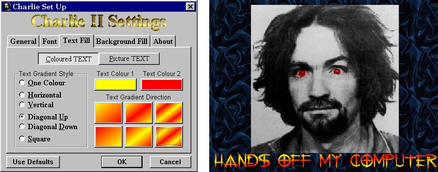



## A Screen Saver with the Lot \!

### Description

Heaps of code and functionallity you can use here!

This is an almost complete re-write of my earlier "Talking" Charlie screen saver. This version is heavily documented, it will display in the Preveiw Pane of the Display Properties dialog and has a myriad of available settings to allow for colour gradients or user defined pictures in the text and backgrounds, as well as it's own Font selection dialog (Thanks to Rob Bogdanoff for the Fonts code).

If you are going to Vote, don't judge me on my "off tap" sense of humour or lack of taste, just evaluate the code and functionality of the project itself, which I reckon is S**t Hot!
 
### More Info
 

             |
---                |---
**Submitted On**   |2001-08-02 07:09:56
**By**             |[Nero](https://github.com/Planet-Source-Code/PSCIndex/blob/master/ByAuthor/nero.md)
**Level**          |Intermediate
**User Rating**    |4.4 (22 globes from 5 users)
**Compatibility**  |VB 5\.0, VB 6\.0
**Category**       |[Complete Applications](https://github.com/Planet-Source-Code/PSCIndex/blob/master/ByCategory/complete-applications__1-27.md)
**World**          |[Visual Basic](https://github.com/Planet-Source-Code/PSCIndex/blob/master/ByWorld/visual-basic.md)
**Archive File**   |[A Screen S23930812001\.zip](https://github.com/Planet-Source-Code/nero-a-screen-saver-with-the-lot__1-25758/archive/master.zip)

### API Declarations

The APIs used by this program are: timeGetTime, ShowCursor, BitBlt, StretchBlt, DrawText, GetClientRect, GetWindowLong, GetDesktopWindow, PaintDesktop, GetStretchBltMode, SetStretchBltMode, SetWindowLong, SetParent, SetWindowPos, FindWindow, DrawFrameControl, DrawFocusRect, EnumFontFamilies, GetDC and ReleaseDC.

